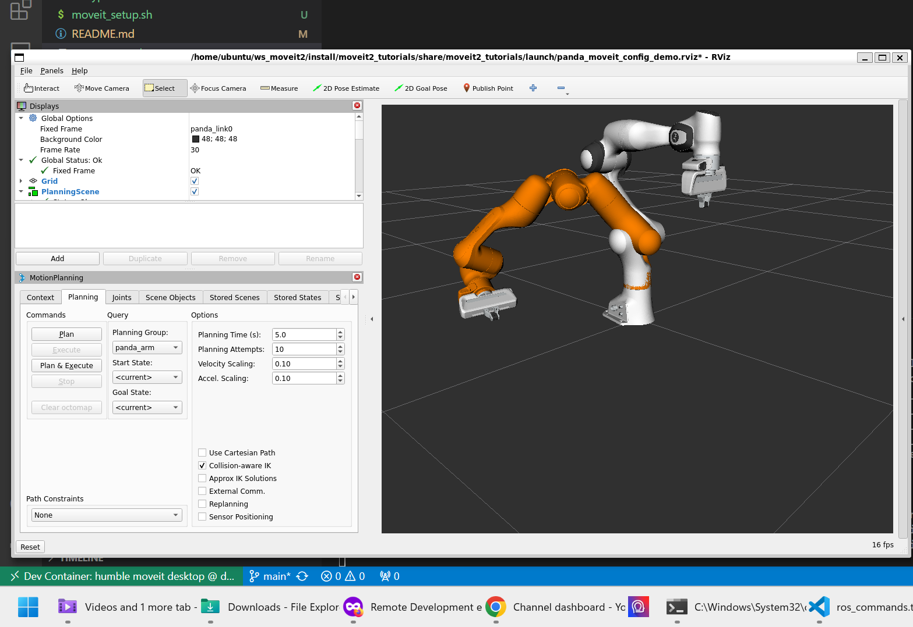
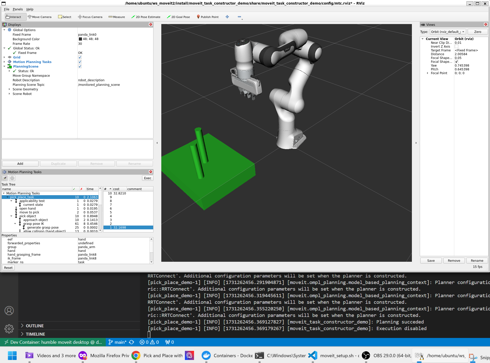

# dockered_humble_moveit
Docker setup for MoveIt2 with ROS2 Humble for use in Windows

## Requirements
- [Visual Studio Code](https://code.visualstudio.com/) (tested)
- [Remote Development extension pack](https://marketplace.visualstudio.com/items?itemName=ms-vscode-remote.vscode-remote-extensionpack) in Visual Studio Code Marketplace.


### Note
This example setup has been tested on Windows 11. The official MoveIT2 Docker image works on Linux but not Windows. Thus, working with Windows OS requires building MoveIT2 from source code as done in this example. This example does not mount any volumes or GPUs.

## Getting Started

1. Clone the repository
    ```sh
    mkdir -p dockered_moveit2
    cd dockered_moveit2
    git clone https://github.com/MasterpieceNKA/dockered_moveit2.git
    ```

2. Reopen in Container


3. Setup MoveIT2 using provided script

    ```sh
    ./moveit_setup.sh
    ```

4. Test using MoveIT Tutorial Demos

a) Motion Planning Demo

    ```sh
    source ~/ws_moveit2/install/setup.bash \
        && ros2 launch moveit2_tutorials demo.launch.py
    ```



b) MoveIT Task Planner Pick and Place Demo

```sh
source ~/ws_moveit2/install/setup.bash && \
    ros2 launch moveit_task_constructor_demo demo.launch.py
```
Open new Terminal

```sh
source ~/ws_moveit2/install/setup.bash && \
    ros2 launch moveit_task_constructor_demo run.launch.py exe:=pick_place_demo
```




## Setup YouTube video guide

[](https://www.youtube.com/watch?v=O-1l_8msafI) 


